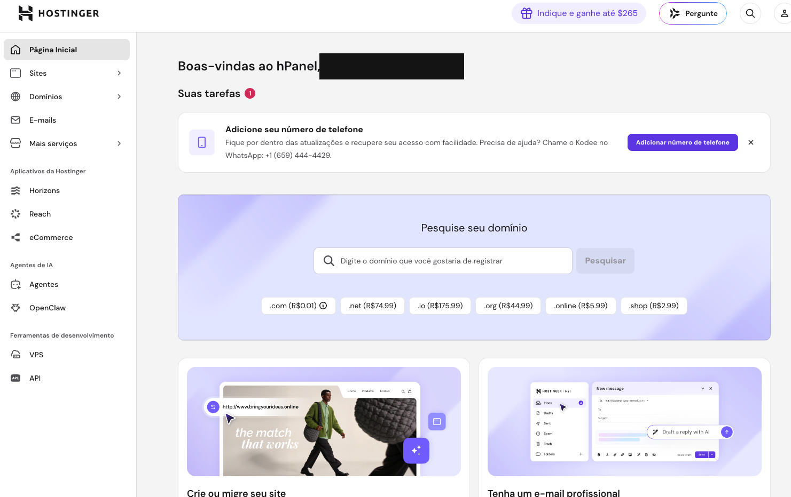
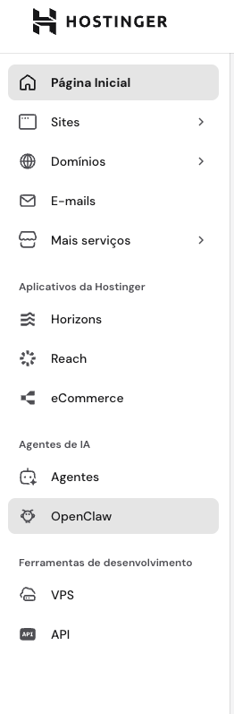
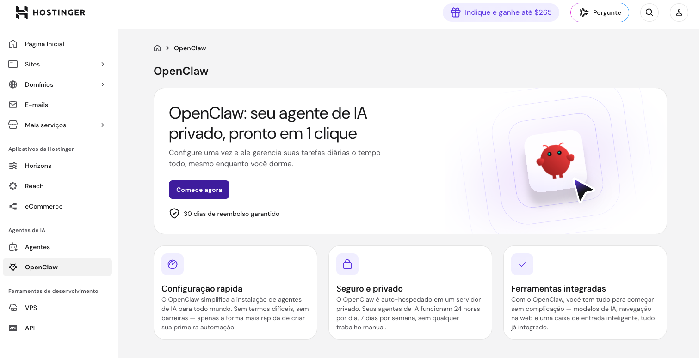
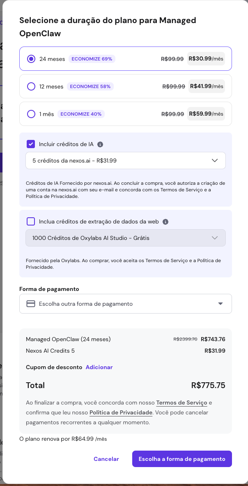
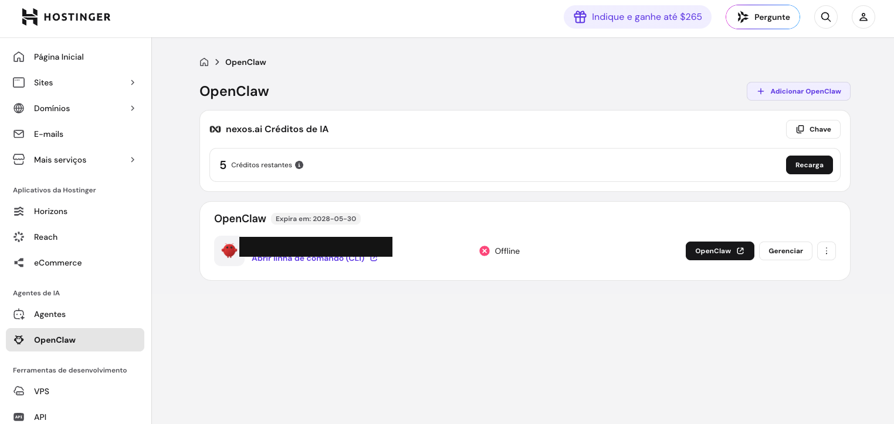

# 🌱 Eva Starter Kit — crie a sua assistente de IA pessoal

> 🇧🇷 **Português (você está aqui)** · 🇲🇽 **Español:** [README.es.md](README.es.md)

> **Em 1 frase:** este kit te ajuda a ter a **sua própria assistente de inteligência artificial**
> (vamos chamar de **Eva**) — que conversa com você no Telegram/WhatsApp, lembra das suas coisas e
> usa as suas ferramentas. **Você não precisa saber nada de tecnologia.** É só seguir os passos.

> 🧒 **Feito pra qualquer pessoa.** Se você sabe usar WhatsApp e fazer uma compra na internet,
> você consegue. A própria Eva vira sua **professora** e faz o trabalho difícil por você.

---

## ✅ O que você precisa (só isso)
- 📶 Internet
- 💳 Um cartão de crédito
- ⏱️ ~15 a 30 minutos
- ☕ Calma — vai dar tudo certo

---

## 🛣️ Existem 2 jeitos. Qual é o seu?

Pense numa **casa** pra sua Eva morar:

| | 🟢 **Jeito FÁCIL** (casa alugada) | 🔵 **Jeito PODEROSO** (casa própria) |
|---|---|---|
| Pra quem | Quer o **mais simples** possível | Quer **controle total** e é mais curioso |
| Como | Você assina um serviço pronto (Hostinger) | Você cria um servidor na Google (guiado) |
| Tempo | ~5 min | ~20 min |
| **Recomendado pra começar** | ⭐ **SIM** | — |

> 👉 **Na dúvida, vá no Jeito FÁCIL (🟢).** Você pode mudar depois.

---

## 🟢 JEITO FÁCIL — passo a passo (Hostinger)

Quando você entra na Hostinger, cai no **hPanel** (seu painel de controle):



### Passo 1 — Achar o OpenClaw no menu
No menu da **esquerda**, em **"Agentes de IA"**, clique em **OpenClaw**.



### Passo 2 — Começar
Clique no botão roxo **"Comece agora"** (ou em **"Adicionar OpenClaw"**).



### Passo 3 — Escolher o plano e pagar 💳
Escolha a duração (o de **1 mês** já serve pra testar; os planos maiores saem mais barato por mês),
deixe os **créditos de IA** marcados, escolha a forma de pagamento e confirme.



> 🔒 Só **você** digita o cartão. Tem **30 dias de reembolso garantido**.

### Passo 4 — Acessar a sua Eva
Feito o pagamento, sua Eva aparece aqui. Clique em **"OpenClaw"** (abre o painel dela) ou em
**"Abrir linha de comando (CLI)"** pra **conversar com o agente**.



### Passo 5 — Dar este kit pra ela e mandar ela te ensinar
No chat do seu novo agente, **cole exatamente esta mensagem**:

> *"Recebi um kit de instalação. Leia o arquivo `0-LEIA-PRIMEIRO.md` e seja meu tutor a partir daí.
> Pode rodar a skill /criar-eva."*

Pronto! A partir daí **a própria Eva te guia** — o nome dela, o Telegram, suas ferramentas e
(importante!) o **backup**. É só responder o que ela perguntar. 🎉

> 📥 *Como pegar os arquivos do kit?* Veja "📦 Como baixar este kit" mais abaixo.

## 🔵 JEITO PODEROSO — passo a passo (servidor na Google)

> Mais passos, mas a Eva fica 100% sua. **A Eva também te guia aqui** — você não está sozinho.

### Passo 1 — Criar conta na Google Cloud
Acesse **console.cloud.google.com**, entre com sua conta Google, crie um **projeto novo** e
**ative o faturamento** (cartão — o uso inicial costuma cair nos créditos grátis).


### Passo 2 — Abrir o "Cloud Shell"
No topo do site, clique no ícone **`>_`** (Cloud Shell). É um terminal que já vem pronto.


### Passo 3 — Rodar os 2 comandos
Cole os comandos abaixo (a Eva/este kit te dá eles prontos):
```bash
bash provision-gcp.sh SEU_PROJETO     # cria o servidor
# depois, dentro do servidor:
sudo bash install-eva.sh              # instala a Eva
```

### Passo 4 — Falar com a Eva e mandar ela te ensinar
Quando ela responder a um "oi", mande: *"Leia o `0-LEIA-PRIMEIRO.md` e rode /criar-eva."*
Daí em diante é igual ao jeito fácil: ela te guia no resto. 🎉

---

## 📦 Como baixar este kit (do GitHub)
1. No topo desta página, clique no botão verde **`< > Code`**.
2. Clique em **Download ZIP**. (Ou pegue a [Release mais recente](../../releases) — é o jeito recomendado.)
3. Descompacte o arquivo. Pronto — é esse conteúdo que você entrega pro seu agente.


> Quem manja de Git pode: `git clone https://github.com/carlosmarins/eva-starter-kit.git`

---

## 🛟 O MAIS IMPORTANTE: nunca perca a sua Eva
A Eva guarda tudo na "memória" dela. Pra **nunca perder** isso (mesmo se o servidor sumir):
- A própria Eva **salva o cérebro dela no SEU GitHub** (um cofre privado), automático, a cada 2h.
- Ela **te avisa** se o backup parar.
- Se um dia precisar, é só recuperar (tem um guia `COMO-RESTAURAR.md` dentro do seu cofre).

> ⚠️ **Não confie só no backup do serviço** — ele pode falhar. O cofre no **seu GitHub** é o que
> garante. A Eva configura isso pra você no `/criar-eva` (passo de backup). **Não pule.**

---

## 🆘 Travou? Deu erro?
- A Eva foi ensinada a **perguntar** quando não sabe — então responda o que ela perguntar.
- Erro no serviço pago? Chame o **suporte** do provedor.
- Mais dúvidas: veja o **[FAQ.md](FAQ.md)**.

---

## 🗺️ O que tem dentro do kit (pra curiosos)
- `0-LEIA-PRIMEIRO.md` — instruções pro agente virar seu tutor
- `skills/criar-eva/` — o comando `/criar-eva` que conduz tudo
- `skills/backup-eva/` — o backup à prova de falhas
- `wizards/` — os passos guiados (casa → identidade → canais → ferramentas → backup)
- `install/` — scripts pra montar o servidor próprio
- `templates/`, `tools/`, `FAQ.md`, `COMO-RESTAURAR.md`

---

<sub>Feito com ❤️ pra deixar IA pessoal ao alcance de qualquer um · MIT · github.com/carlosmarins/eva-starter-kit</sub>
